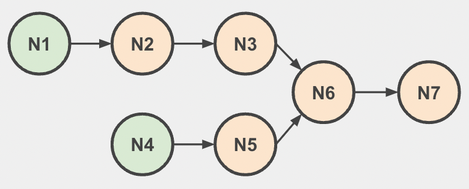

# Linked List Intersection 

Think out loud, ask clarifying questions, pseudocode is fine, I can give hints, we care more about reasoning than syntax.

## Problem
We have two chains of objects, `list1` and `list2`, that may eventually intersect and share the same objects.

Each object has a `next` pointer/reference to the next object (or `null` at the end). You can think of this as a "linked list", but you don't need to know any special linked-list tricks or terminology-this is just object traversal.

We need to find the object at which they intersect; in other words, we need to find the first object they have in common.

For example, in the diagram below, if the heads of `list1` and `list2` are the nodes marked N1 and N4, respectively, the intersecting node would be the one marked N6.

Assume the value in each node is completely irrelevant to its position.

## Definitions

`list1` and `list2` are each the "head" of a chain of objects (in the starter code they are instances of `ListNode`).

Each node/object has two properties:

- `value`: the data it contains (this is irrelevant for solving the intersection)
- `next`: a reference/pointer to the next node/object in the chain (or `null`)

Important: "intersection" means the two chains contain the exact same node object in memory (reference equality / identity), not that they have the same `value`.

## Challenge

Write a function to solve the problem. Your function should take two arguments, `list1` and `list2`, each containing the head node/object. If the two chains intersect, your function should return the node/object at which they intersect. If they do not intersect, your function should return `null`.

Specifications:

- `list1` and `list2` are nodes/objects with a `next` reference (in the starter code they are `ListNode` instances)
- The function returns a node/object (a `ListNode` in the starter code) or `null`
- Neither chain loops on itself (i.e., neither eventually points back to a previously-seen node)

Once you've written your function, explain the time complexity of your solution.