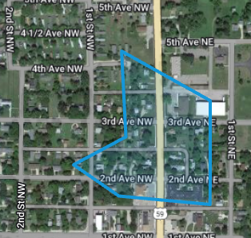

# Polygon Architecture

Think out loud, ask clarifying questions, pseudocode is fine, I can give hints, we care more about reasoning than syntax.

## Problem
We're creating a Web application that lets user create a custom map based on Google Maps. We want to allow the user to draw a polygon on the map, as shown below:

## Challenge
Design a class, prototype, or data structure to represent a Polygon in this web app.

This question is intentionally open-ended. There isn’t one “right” design; we’re looking for how you structure a solution, adapt it as requirements change, and communicate tradeoffs.

You can answer with:

- a class / interface design. This could be in pseudocode or a specific language, it could be object-oriented or functional.
- a data model (JSON shape) plus supporting services/helpers
- a mix (domain model + rendering adapter)

## Suggested approach (scaffold)

If you want a structure to follow, this works well:

1. **Core data model**: what is a Polygon in memory?
2. **Core operations**: create/edit, add/remove/move points, validation
3. **Rendering boundary**: how it connects to the mapping/UI layer
4. **Persistence boundary**: how it is saved/loaded (serialization)
5. **Scaling & constraints**: permissions, performance, evolution

## Phased requirements

Start with Phase 0. The interviewer will add phases one at a time.

### Phase 0 (baseline)

Design the Polygon representation and answer:

- What fields/properties should a Polygon have?
- What functions/methods should be defined on a Polygon (or in helpers/services)?
- What utilities/helper functions/class methods would be useful?

Initial requirements:

1. A user can **create** a polygon by providing a list of vertices.
2. A user can **edit** a polygon by moving vertices (or adding/removing vertices).
3. A polygon can be **rendered** on a map (assume *some* mapping API exists; don’t assume it looks like Google Maps).

### Phase 1 (multiple shapes & UI interaction)

Add support for:

1. There can be an arbitrary number of polygons on the map at the same time.
2. The color of each polygon can be customized.
3. A polygon can be clicked to inspect its area and perimeter.

### Phase 2 (persistence)

Add support for:

1. Each polygon is saved to a central database and loaded when a user re-opens the application.

### Phase 3 (permissions)

Add support for:

1. Users can see all polygons on the map, but can edit only polygons they created.

### Phase 4 (spatial queries & extensibility)

Add support for:

1. Any point on the map can be inspected to see which, if any, polygons contain that point.
2. Shapes such as circles and constrained rectangles (four points with 90 degree corners) should be supported.

For each phase, discuss how you would alter your design to accommodate the new constraints, or how your design anticipated them.

## Complications

## Complications
- We want to support Lines with no fill, reusing as much Polygon logic as possible.
- The application is becoming sluggish and unresponsive due to a large number of Polygons.
- Our database vendor charges a lot for storage space. We want to minimize the space taken up by each Polygon.
- There's a tendency for old Polygons to break whenever we change how they are stored in the database.

## Notes and Discussion

