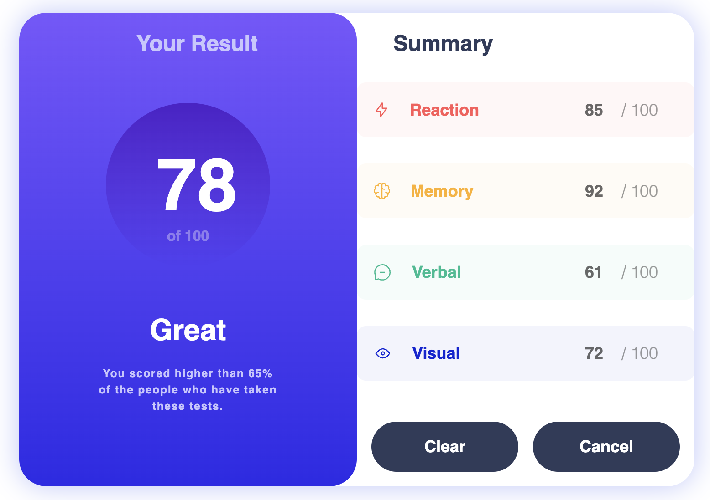
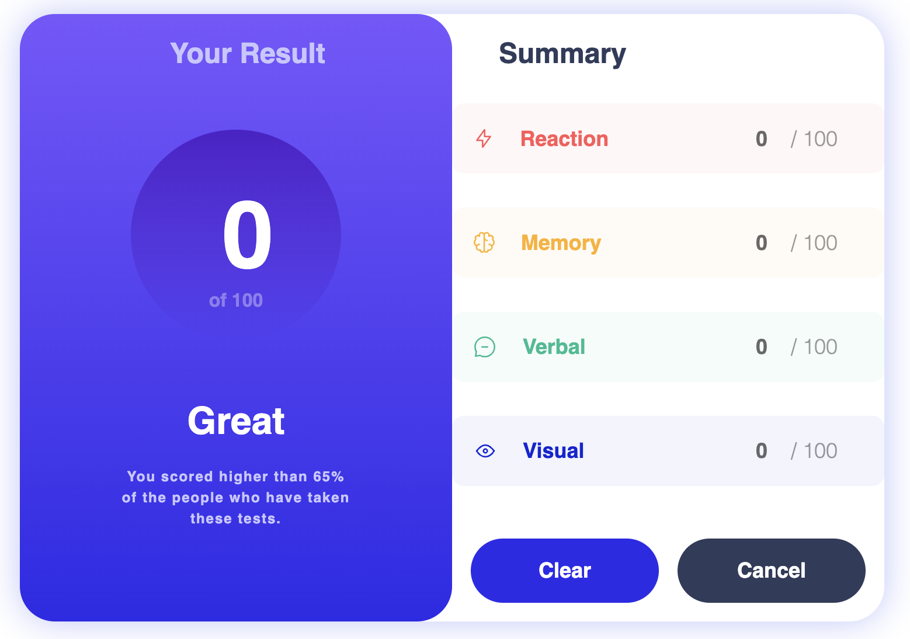

# Challenge

This is a simple Vue app with Single File Components. The challenge will be to fix some bugs that are preventing the app from building and displaying properly. Then we will add some features to the app like loading data from an external API. 

This is not a trick question. Feel free to:

- Think out loud and ask clarifying questions
- Use the Vue docs and browser devtools
- Make small, iterative changes and verify as you go

You do not need prior Vue experience to do well on this challenge. If you're not familiar with Vue, treat it like a small HTML/CSS/JS app with a templating layer, and ask questions as you go.

## Recommended VS Code extension

To get good Vue syntax highlighting, template type-checking, and helpful error messages, install the recommended Vue extension:

- **Vue - Official** (Volar)

In a browser-based VS Code environment (Codespaces, Stackblitz), open Extensions and install the recommended extension when prompted.

## Running the project
- If you want to run both frontend + backend together, you can use `npm run start`. If this is being run on Stackblitz, the project should already be running.
- Open the terminal and enter `npm run dev`. This will launch the frontend dev server. When you save a file, the app will rebuild and reload.  
- Open another terminal and enter `npm run backend`. This will launch the backend dev server. When you save a file, the app will rebuild and reload.  

## 1. Bugs
There are bugs! The app won't even build right now. Your mission is to get the app building and fix the bugs so that it looks like the following image:

Then, when the "Clear" button is clicked, it should clear the scores like so:

Pay close attention to the screenshots, the styles and colors need to match exactly. 

### Pixel-perfect expectations (and help)

Matching the screenshots closely is intentional (it's partly an attention-to-detail exercise). You're welcome to use browser devtools to inspect CSS, spacing, and computed styles.

If you get stuck trying to spot a subtle difference, say so-we can give small hints to help you un-block.

## 2. Features
Now that the bugs are fixed, we can add the new features. Right now, we are using static mock data that is hard-coded into the app. We need to replace this with data loaded from an API. Refer to [the API documentation](https://app.swaggerhub.com/apis-docs/samschurter/UserDataAPI/0.1) for instructions on accessing and using the API.

In any order, we need to accomplish the following:
- The app should display the list of users first, not the scores
- The list of users should be retrieved from the API
- Clicking a user's name should display that user's score
- The data for an individual user should be loaded from the API
- When viewing the scores for a particular user, clicking the "Cancel" button will return the app to the main list of users.
- Implement the `loadUsers()` function in `App.vue`. It is called by the `mounted()` hook and a "Refresh" button, so it needs to fetch the auth token, request the user list, update component state, and manage the loading spinner/error message for both success and failure paths.

### Helpful notes:
- The API base URL changes with the name of the Codespaces container. It has been precalculated at the top of each `.vue` file, but in some environments that may not be correct. To find the base URL of the API, 
    - Press `Cmd+Shift+P` (macOS) / `Ctrl+Shift+P` (Windows/Linux) to open the Command Palette, type `ports` and hit `Enter` to open the Ports panel
    - Locate the `backend (3000)` port
    - Hover over the Local Address and click the Copy to Clipboard button.
- If you are getting CORS errors when trying to access the API, the API port may not be set to public. Open the Ports panel as described above, right click on the `backend (3000) port, and select Port Visibility -> Public
- Hot reloading does not always work when some major changes have been made. If the changes you are expecting do not appear in the preview, try reloading the page. If that does not work, kill and restart the dev server, then reload the page.
- The backend intentionally responds slowly (about 1-2 seconds) so you can see the loading spinner. It also returns HTTP 429 (Too Many Requests) roughly 30% of the time. Make sure `loadUsers()` clears the spinner and surfaces a helpful error message even when the request fails, so the user can click Refresh to retry.
